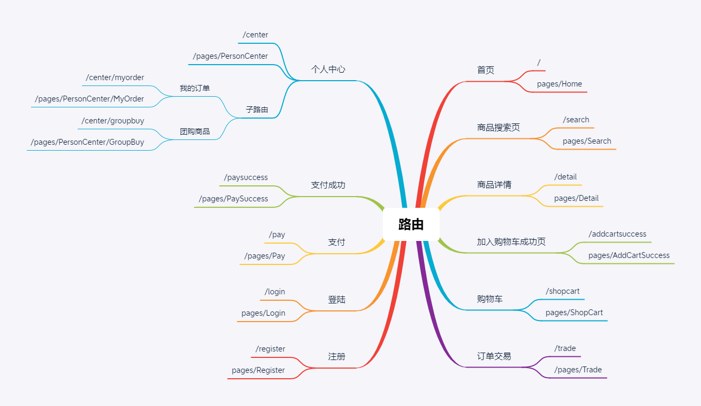
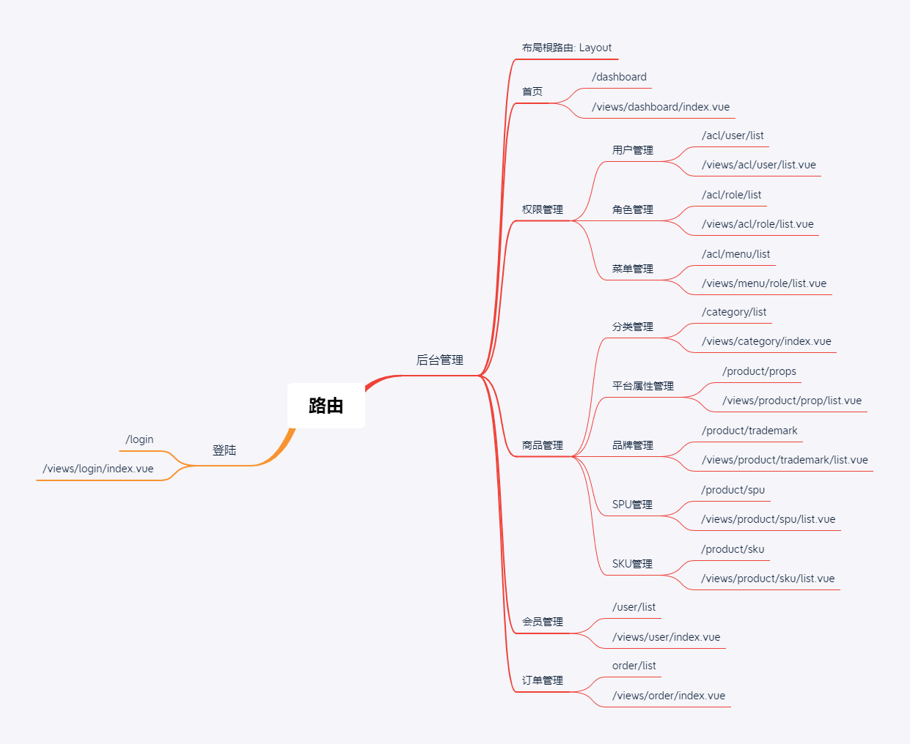
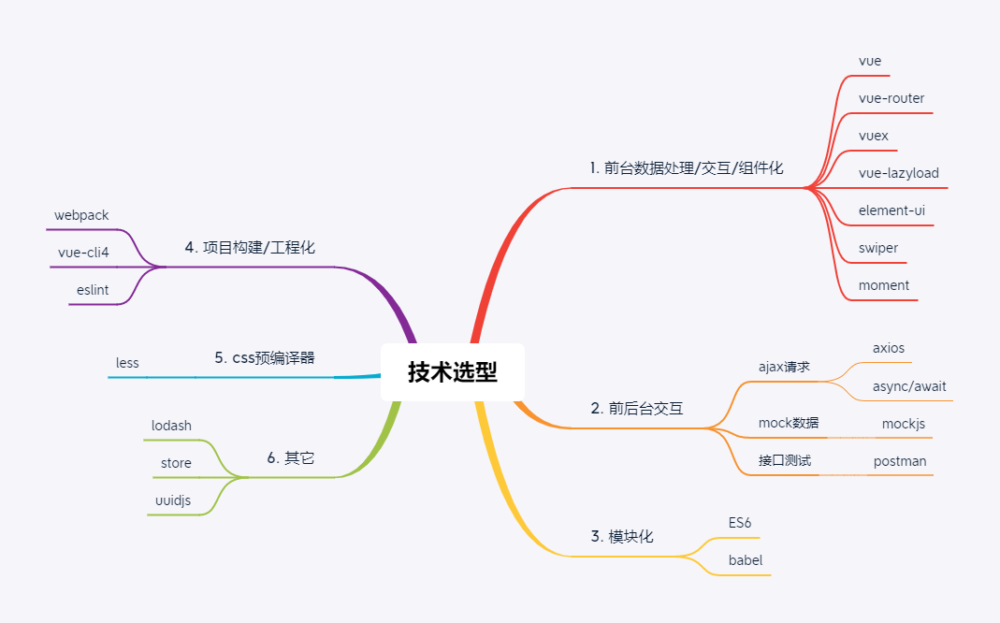

<p align="center">
    
    
    
     
    <a href="https://github.com/springbear2020/atguigu-store" target="_blank">
        
    </a>
</p>

# 一、快速开始

## 1.1 前台应用系统

1. 克隆仓库：使用 Git 克隆仓库或直接下载仓库压缩包到您的计算机来获取源代码。
2. 打开工程：使用 WebStorm 开发工具打开 store-frontend 前台应用系统模块。
3. 安装依赖：在控制台使用 npm install 命令安装项目所需依赖。
4. 启动项目：使用 npm run serve 命令运行项目，运行成功后访问 http://localhost:8080。

## 1.2 后台管理系统

1. 克隆仓库：使用 Git 克隆仓库或直接下载仓库压缩包到您的计算机来获取源代码。
2. 打开工程：使用 WebStorm 开发工具打开 store-backend 后台管理系统模块。
3. 安装依赖：在控制台使用 npm install 命令安装项目所需依赖。
4. 启动项目：使用 npm run dev 命令运行项目，运行成功后将自动打开登录首页或访问 http://localhost:9528 进行登录。

# 二、项目介绍

基于 Vue.js 实现的 SPA 尚品汇在线电商项目，包含前台应用系统和后台管理系统两大部分，涵盖首页、购物车、订单支付和数据管理等众多子模块。

# 三、接口文档

| 系统         | 基础请求路径                                | 文档地址                                                     |
| :----------- | :------------------------------------------ | :----------------------------------------------------------- |
| 前台应用系统 | http://gmall-h5-api.atguigu.cn              | [尚品汇前台API接口文档.doc](./document/doc/尚品汇前台API接口文档.doc) |
| 后台权限管理 | http://39.98.123.211:8170/dev-api/admin/acl | http://39.98.123.211:8170/swagger-ui.html                    |
| 后台管理系统 | http://39.98.123.211:8510/dev-api/admin     | http://39.98.123.211:8510/swagger-ui.html                    |

# 四、功能架构

# 五、系统路由

## 5.1 前台应用系统



## 5.2 后台管理系统



# 六、技术选型



# 七、工程结构

```lua
src
├── api 		-- api 网络接口
├── assets 		-- 静态图片资源文件
├── components 	-- 通用组件封装
├── mock		-- 模拟数据
├── icons 		-- svg 矢量图片文件
├── router 		-- vue-router 路由配置
├── store 		-- vuex 的状态管理
├── styles 		-- 全局 css 样式
├── utils 		-- 工具函数
└── views 		-- 路由组件
```

# 八、效果展示

## 8.1 前台应用系统

## 8.2 后台管理系统

# 九、许可证

```
MIT License

Copyright (c) 2023 Spring-_-Bear

Permission is hereby granted, free of charge, to any person obtaining a copy
of this software and associated documentation files (the "Software"), to deal
in the Software without restriction, including without limitation the rights
to use, copy, modify, merge, publish, distribute, sublicense, and/or sell
copies of the Software, and to permit persons to whom the Software is
furnished to do so, subject to the following conditions:

The above copyright notice and this permission notice shall be included in all
copies or substantial portions of the Software.

THE SOFTWARE IS PROVIDED "AS IS", WITHOUT WARRANTY OF ANY KIND, EXPRESS OR
IMPLIED, INCLUDING BUT NOT LIMITED TO THE WARRANTIES OF MERCHANTABILITY,
FITNESS FOR A PARTICULAR PURPOSE AND NONINFRINGEMENT. IN NO EVENT SHALL THE
AUTHORS OR COPYRIGHT HOLDERS BE LIABLE FOR ANY CLAIM, DAMAGES OR OTHER
LIABILITY, WHETHER IN AN ACTION OF CONTRACT, TORT OR OTHERWISE, ARISING FROM,
OUT OF OR IN CONNECTION WITH THE SOFTWARE OR THE USE OR OTHER DEALINGS IN THE
SOFTWARE.
```
